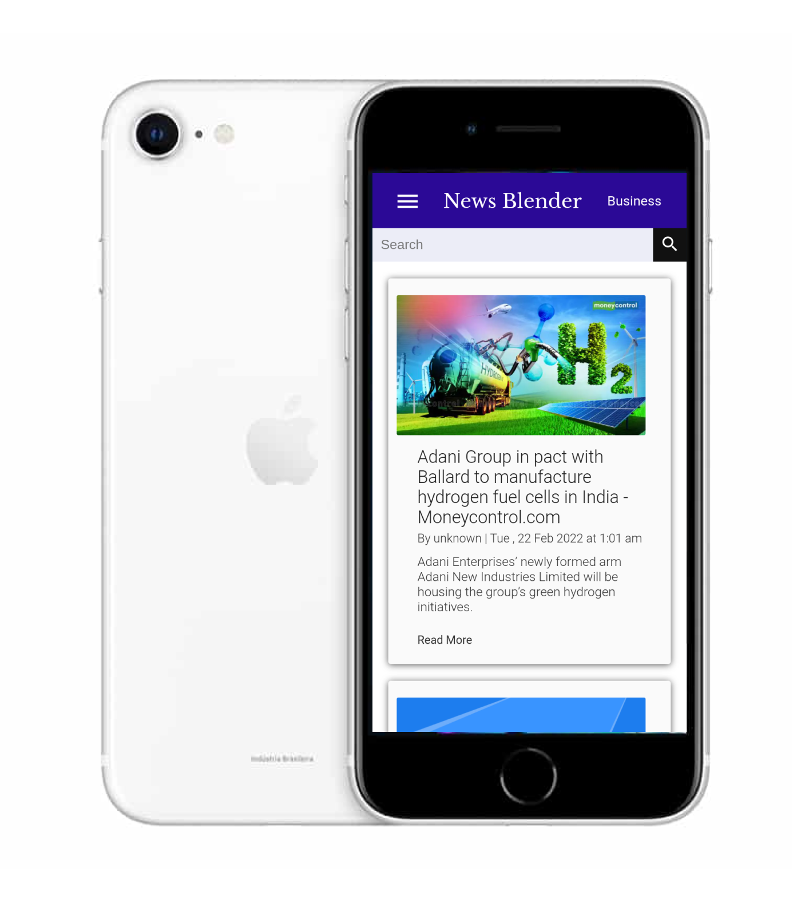

# NewsBlender
**NewsBlender** is a news web app built using React.js and Material UI. It makes use of [News API](https://newsapi.org/) to fetch all the worldwide news and displays them to the users according to their needs.

### Features
* A user can see the trending news in his or her country
* A user can search for any news in the search bar
* A user can switch to different categories of news like sports related news or science related news
* To save the user's internet consumption, pagination feature has also been added in this web app

### Project Purpose
The purpose of this project is to demonstrate how can a person:
* Send HTTP requests like GET and POST to a web server using tools like [Axios](https://www.npmjs.com/package/axios)
* Implement MaterialUI components like navigation drawer in his or her project
* Make responsive design using CSS properties like flexbox and media queries
* Implement pagination in the app

### Project Setup
* Install [Visual Studio Code](https://code.visualstudio.com/download) which is the text editor in which we will be making our app
* Clone this repository and open it in github
* Create a [newsapi.org](https://newsapi.org/) account and get your API KEY that will be used to get all the worldwide news
* Then in the root folder of your project, create a file with name ".env"
* And in that file, write: REACT_APP_API_KEY=pasteYourAPIKeyFromNewsApi
* Make sure that the variable name and API key are correct and do not add semicolons and double quotes in the API Key
* Once completed, Open the terminal in VSCode and write npm start
* And enjoy the project

#### Things you should know before exploring this project
* React.js: It is a library that makes it really easy for us to create web pages with advanced UI. Unlike Bootstrap whose primary purpose is to achieve responsive design, using react.js, you can achieve responsive design and unique and customized UI
* Component: A component is simply a piece of HTML code that is rendered by react.js. Like you have a form tag with some input tags and buttons. Using react.js, you can move all the form code inside a file (say FormComponent.js). And then whenever you want to use it, you just need to write &lt;FormComponent &#8725; &gt; Using this feature, we can get rid of boilerplate code in our project
* MaterialUI: A library created by google that lets you add really beautiful ready to use components like buttons, navigation menues etc in your project

#### Project Files
* App.js: This is the actual file where we write all our business logic and return HTML renderable content
* App.css: This file contains all the css code that belongs to our App.js file
* index.js: This file is used by react.js to render our App.js component's content into the web page along with some react.js configurations
* index.css: This file contains index.js related css code
* index.html: This file binds or merges all our files together and displays it on the screen
* manifest.json: This file contains some react.js configurations like icons, theme colors, etc

#### Project Folders
* components: This folder contains the react.js components like HeaderComponent.js (For the header div), NewsCardComponent.js (For each news box) etc
* public: This folder contains data that will be exposed to the public or all the users who see this app. It contains files like our index.html file and some configuration files

#### Deployment
Since the API I have used in this project is free only for practice purpose, you won't be able to host this project on a server. If you do so, you won't get any data from the API. If you are planning to host this project on a server, then either go for a paid plan, or if you still want to host it on a server for demonstration purpose, try using a proxy

## Contact
For any queries, you can mail me at developerishant710@gmail.com

